# Part Two: Director-Based Reviews

By default, OCS provides you with a complete peer review system for submissions. For some conferences, however, this may not be appropriate, and a simpler alternative is required. The following steps will show you how to create a director-based review system.

## Step One: Setup

Login as the Conference Manager, and under Current Conferences, choose Setup:

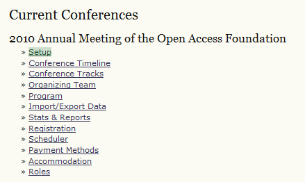

In Setup Step 1, fill in the details about the conference, such as an Overview, description, contacts, etc.:

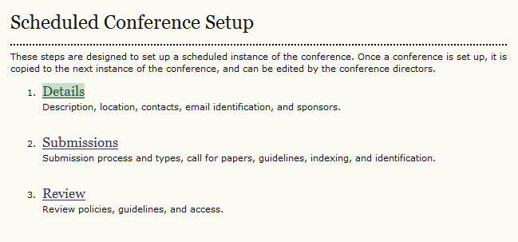

In Setup Step 2.1, you must decide how you wish to accept submissions:

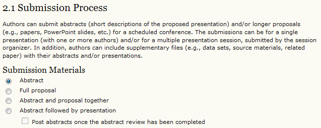

The first option (Abstract) will allow authors to submit an abstract only. No further documents can be submitted. If you plan to judge a submission by its abstract alone, and only post the abstract to the web site, this is the best option.

The second option (Full Proposal) will allow authors to submit a longer proposal, such as a separate paper (often a Word document) or presentation (often a Powerpoint document). No abstract will be provided. Use this option if you wish to judge the submission based upon more detail and have the option of posting the proposal document to the web site.

The third option (Abstract and Proposal Together) allows the author to submit both an abstract and a separate proposal document. This option provides the option of posting both an abstract and a proposal document to the web site upon acceptance.

The fourth option (Abstract Followed by Presentation) allows authors to first submit an abstract. If the abstract is accepted, they will then have the option of later submitting a full paper or presentation. This option will also allow you to post both the abstract and the full paper/presentation to the web site.

You should also check the checkbox to post the abstracts upon completion of the review. This helps to automate the posting process.

This document will be based upon the fourth option: Abstract Followed by Presentation.

To complete Setup Step 2, review the appropriate section of [OCS in an Hour](https://pkp.sfu.ca/files/OCSinanHour.pdf).

In Setup Step 3, under Review Policy, you may want to state that papers will be reviewed by a team of expert directors (as opposed to blind reviewers):

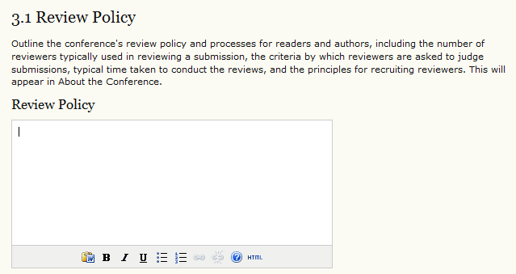

Since you will have no non-director “reviewers”, section 3.2 is not necessary and can be bypassed:

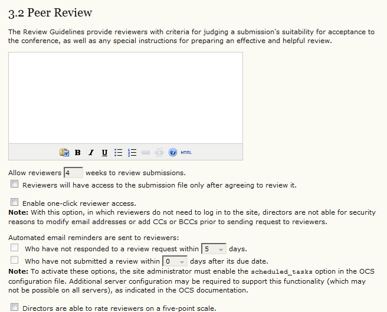

Finally, check off the Director Decision box in step 3.3, to keep all authors informed of your decision:

Next, from the Conference Manager menu, choose Conference Tracks:

This will take you to the Conference Track page:

Use the Create Track link to create a new track for your conference:

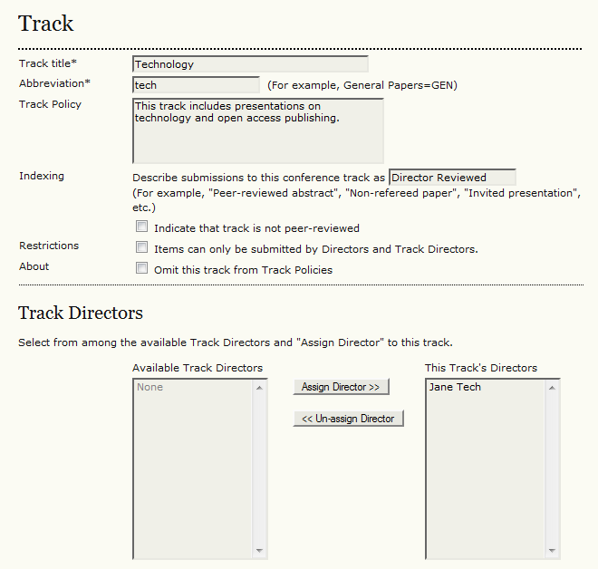

Fill in the form, and assign an existing Track Director to this track (for details on creating users and enrolling them as Track Directors, see [OCS in an Hour](https://pkp.sfu.ca/files/OCSinanHour.pdf)).

At this point, continue filling in the configuration options (e.g., Conference Timelines, Organizing Team, etc.) as outlined in [OCS in an Hour](https://pkp.sfu.ca/files/OCSinanHour.pdf).

## Step Two: Incoming Submissions

Now that your site has been successfully setup, submissions will start coming in (review [OCS in an Hour](https://pkp.sfu.ca/files/OCSinanHour.pdf) for information on how authors make their submissions). Your Track Directors will receive an email when a new one comes into their track, and they will login to OCS as a Track Director to manage them (for details on enrolling yourself and others as Directors or Track Directors, see [OCS in an Hour](https://pkp.sfu.ca/files/OCSinanHour.pdf)):

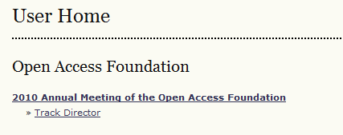

Then, they’ll see the new submission:

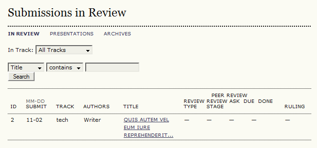

Click on the linked title to go to the submission record:

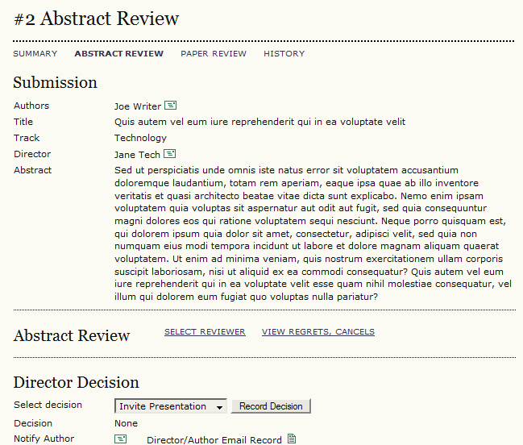

From here, the Track Director will read the abstract, ignore the Abstract Review section (as this is a Director-based review – see [OCS in an Hour](https://pkp.sfu.ca/files/OCSinanHour.pdf) for the normal review process), and make their decision.

If the decision is to accept, the author will then be able to submit a full paper or presentation file.

If the decision is to revise, the author will be given the opportunity to revise their abstract, based upon comments from the Track Director, or to decide against proceeding with the submission.

If the decision is to reject, the author will be informed that their abstract does not fit in with the requirements of the conference.

Once the decision is made, the Notify Author button must be used to inform the author of the decision:

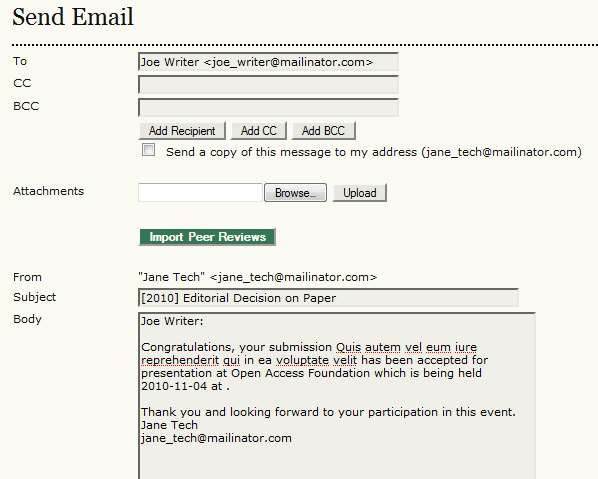

Note: Because we decided to post abstracts upon acceptance on page 10 above, the abstract will now automatically appear on the web site, under Presentations and Authors:

At this point, if accepted, the author will be able to upload their final paper or presentation file. Once this is done, it will be available for the Track Director to post:

Click on the link (2-2-1-RV.DOC) to download the file and review it. If it is acceptable, format it into a PDF (if necessary), using software such as Adobe Acrobat or CutePDF.

Once you have the PDF or Powerpoint file ready to post, scroll down to the Layout section, and upload it as a Galley, using the upload tool:

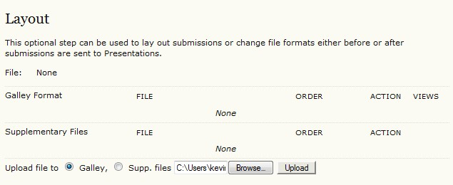

The file will now appear alongside the abstract on the web site:

That completes the submission, director-based review, acceptance, and posting of the paper/presentation

